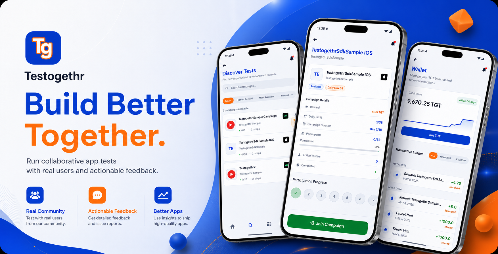

# Testogethr iOS SDK (Swift Package)



[](https://github.com/Moozart/testogethr-sdk-ios-spm/stargazers)
[](https://github.com/Moozart/testogethr-sdk-ios-spm/releases/latest)

Public Swift Package Manager repository for Testogethr iOS SDK binary distribution.

## What Testogethr Does

Testogethr helps mobile teams run collaborative testing before release and ship with confidence.

It is designed for teams that need reciprocal testing support for **Google Play Closed Testing** and pre-production validation before moving to production.

With the SDK, you can:

- Find reciprocal testers for Google Play closed and production-readiness test cycles
- Run test campaigns with real users from the community
- Collect actionable feedback and issue reports quickly
- Improve release quality before public rollout

## Integrate Faster with AI

Use the official docs AI-assisted quick start:

- AI-assisted intro and setup: <https://docs.testogethr.com/docs/intro>
- Full integration guide: <https://docs.testogethr.com/docs/usage>

You can copy the AI prompt from docs and generate project-specific integration steps in minutes.

## Repository Scope

This repository is for:

- Swift package manifest (`Package.swift`)
- Binary XCFramework release asset hosting
- Public iOS version tags and release notes

This repository does **not** include Testogethr SDK source code. SDK source remains private.

## Quick Links

- Latest iOS release: <https://github.com/Moozart/testogethr-sdk-ios-spm/releases/latest>
- Android showcase repo: <https://github.com/Moozart/testogethr-sdk-android>
- Android+iOS integration guides: <https://github.com/Moozart/testogethr-sdk-android/tree/main/docs>
- Docs homepage: <https://docs.testogethr.com>
- AI-assisted quick start: <https://docs.testogethr.com/docs/intro>

## SDK Access Token (Required)

You must generate the SDK access token from the **Testogethr mobile app**:

1. Open Testogethr app
2. Go to **Profile**
3. Open **API Key Manager**
4. Generate and copy your SDK token

> Critical: SDK initialization will fail without a valid token from **Profile -> API Key Manager**.

## Download Testogethr App

- Android (Google Play): <https://play.google.com/store/apps/details?id=com.testogethr.app>
- iOS (App Store): <https://apps.apple.com/>

## Install with Swift Package Manager

### Option A: Add package in Xcode

1. In Xcode, open **File -> Add Package Dependencies...**
2. Enter:

`https://github.com/Moozart/testogethr-sdk-ios-spm`

3. Select your version rule (recommended: **Up to Next Major**)
4. Add product: `TestogethrSdk`

### Option B: Add in `Package.swift`

```swift
.package(url: "https://github.com/Moozart/testogethr-sdk-ios-spm", from: "<version>")
```

Replace `<version>` with the latest stable tag shown in the **Latest release** badge above.

Then link product:

```swift
.product(name: "TestogethrSdk", package: "testogethr-sdk-ios-spm")
```

## iOS Integration Quick Start

### 1) Declare events and initialize SDK

Initialize as early as possible in your app lifecycle. Declare your events
up front and pass them via `steps`.

```swift
import TestogethrSdk

let bossEvent = DeclaredEvent(
    name: "boss_defeated",
    description: "Fired when the final alien boss is beaten"
)

TestogethrSdkCompanion.shared.initialize(
    sdkAccessToken: "YOUR_SDK_ACCESS_TOKEN",
    config: TestogethrConfig(),
    steps: [bossEvent],
    isDiscoveryMode: true,
    debugLogger: { level, tag, message, throwable in
        if let throwable {
            print("[\(level)] \(tag): \(message) \(throwable)")
        } else {
            print("[\(level)] \(tag): \(message)")
        }
    }
)
```

### 2) Start session from deep link

When Testogethr opens your app, pass the URL to the SDK. It parses the
`sessionToken` query parameter and starts the session when present.

```swift
.onOpenURL { url in
    _ = TestogethrSdkCompanion.shared.get().handleDeepLink(url: url.absoluteString)
}
```

### 3) Send events

```swift
TestogethrSdkCompanion.shared.get().sendEvent(event: bossEvent)
```

You can also send by name:

```swift
TestogethrSdkCompanion.shared.get().sendEvent(eventName: "boss_defeated")
```

## Release Packaging Notes

For each new iOS SDK release:

1. Upload `TestogethrSdk.xcframework.zip` to GitHub Release assets
2. Compute checksum with `swift package compute-checksum`
3. Update `Package.swift` URL + checksum
4. Create tag `vMAJOR.MINOR.PATCH`
5. Publish release notes

## Support

- Integration questions: <https://github.com/Moozart/testogethr-sdk-android/issues>
- iOS package/release issues: <https://github.com/Moozart/testogethr-sdk-ios-spm/issues>
